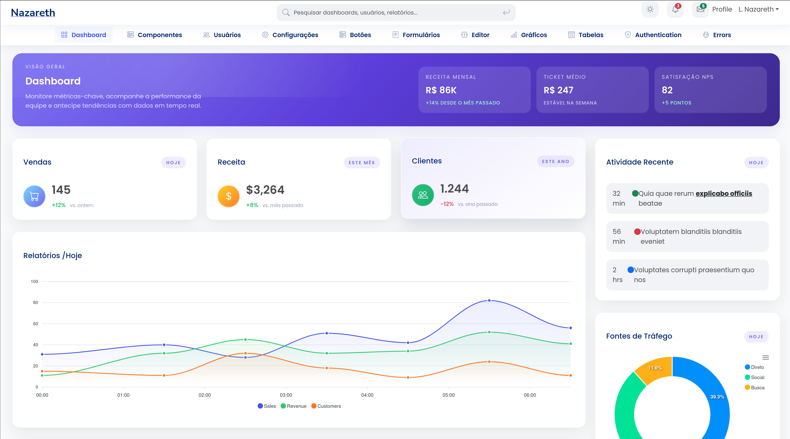

# Template Thymeleaf

Aplicação de exemplo construída com Spring Boot e Thymeleaf para servir como base de dashboards administrativos modernos. O projeto oferece estrutura pronta para páginas responsivas, gráficos, componentes estilizados e integração com Bootstrap.

## Páginas

### Dashboard


### Botões


### Formulários


### Gráficos


### Menu direita


### Menu top


## Sumário

- [Visão Geral](#visão-geral)
- [Tecnologias Utilizadas](#tecnologias-utilizadas)
- [Executando o Projeto](#executando-o-projeto)
- [Usando Maven](#usando-maven)
- [Usando Docker](#usando-docker)
- [Estrutura de Pastas](#estrutura-de-pastas)
- [Licença](#licença)
- [Contato](#contato)

## Visão Geral

O **Template Thymeleaf** foi criado para acelerar o desenvolvimento de portais internos e dashboards. Ele inclui:

- Layout responsivo pronto com header, sidebar e cards informativos.
- Componentes estilizados com Bootstrap 5 e ícones do Bootstrap Icons.
- Exemplos de integração com gráficos (ApexCharts) e tabelas.
- Tema com suporte a light/dark e ajustes de layout via interface.

## Tecnologias Utilizadas

- **Java 17**
- **Spring Boot 3.5.7**
- **Thymeleaf**
- **Bootstrap 5.3** & **Bootstrap Icons**
- **ApexCharts**
- **Maven**
- **Docker & Docker Compose**

## Executando o Projeto

### Usando Maven

1. Garanta que Java 17 ou superior esteja instalado.
2. No diretório do projeto, execute:

   ```bash
   ./mvnw spring-boot:run
   ```

3. Acesse `http://localhost:8080`.

### Usando Docker

1. Construa e suba os serviços:

   ```bash
   docker compose up --build
   ```

2. A aplicação estará disponível em `http://localhost:8080`.

3. Para finalizar:

   ```bash
   docker compose down
   ```

## Estrutura de Pastas

```
template-thymeleaf/
├── src/
│   ├── main/
│   │   ├── java/            # Código fonte Spring Boot
│   │   └── resources/
│   │       ├── static/      # CSS, JS, imagens
│   │       └── templates/   # Páginas Thymeleaf
├── Dockerfile
├── docker-compose.yml
├── pom.xml
└── README.md
```

## Licença

Este projeto está licenciado sob a **MIT License**. Sinta-se à vontade para utilizar, modificar e distribuir, mantendo os créditos da autoria.

## Contato

Projeto desenvolvido por **Leandro Nazareth**. Para sugestões, suporte ou contribuições:
- Linkedin [leandrosnazareth](https://www.linkedin.com/in/leandrosnazareth/)
- GitHub: [github.com/leandrosnazareth](https://github.com/leandrosnazareth)
- Email: [contato@leandrosnazareth.com](mailto:leandrosnazareth@gmail.com)
- Projeto GitHub [github.com/leandrosnazareth/template-thymeleaf](https://github.com/leandrosnazareth/template-thymeleaf)

---


